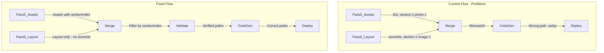

# Fix Image Placement and Path Issues

## Problem Summary

The screenshot replicator has 6 interconnected issues causing images to be placed incorrectly or have broken paths:

1. Asset ID mismatch between analysis passes
2. Section index disagreement across passes
3. Incorrect fallback path extension (hardcoded `.webp`)
4. Position information not structurally tied to code
5. Incomplete handling of failed/skipped assets
6. No validation that paths match generated images

## Architecture Overview



## Implementation Plan

### Fix 1: Remove Layout Pass Asset ID Dependency

**Problem:** Layout Pass returns `assetIds` that may not match Asset Pass IDs.

**Solution:** Always use `sectionIndex` filtering instead of relying on Layout Pass `assetIds`.

**File:** [`src/api/screenshotReplicator/analyze.ts`](src/api/screenshotReplicator/analyze.ts)

Change line 395 from:

```typescript
assetIds: layoutSection?.assetIds || sectionAssetIds,
```

To:

```typescript
assetIds: sectionAssetIds, // Always use computed IDs from Asset Pass sectionIndex
```

Also remove `assetIds` from the Layout Pass prompt and result types since we won't use them.

---

### Fix 2: Correct the Fallback Path Extension

**Problem:** Fallback uses `.webp` for all assets, but icons/graphics should use `.png`.

**File:** [`src/services/screenshotReplicator/codeGenerator.ts`](src/services/screenshotReplicator/codeGenerator.ts)

Create a helper function and fix line 155-157:

```typescript
function getAssetExtension(assetType: string): string {
	return ['photo', 'avatar'].includes(assetType) ? 'webp' : 'png';
}

// In buildSectionPrompt:
const assetRefs = sectionAssets
	.map((asset) => {
		const generated = generatedAssets.find((g) => g.assetId === asset.id);
		const extension = getAssetExtension(asset.type);
		const path = generated?.path || `images/${asset.id}.${extension}`;
		return `- ${asset.id} (${asset.type}): "${asset.purpose}" at position "${asset.position}" → use "/${path}"`;
	})
	.join('\n');
```

---

### Fix 3: Include Explicit Position Information in Prompts

**Problem:** Position is just text in `purpose`, not structured for code placement.

**Solution:** Include the `position` field explicitly and add placement instructions.

**File:** [`src/services/screenshotReplicator/codeGenerator.ts`](src/services/screenshotReplicator/codeGenerator.ts)

Enhance the asset references section in the prompt:

```typescript
const assetRefs = sectionAssets
	.map((asset) => {
		const generated = generatedAssets.find((g) => g.assetId === asset.id);
		const extension = getAssetExtension(asset.type);
		const path = generated?.path || `images/${asset.id}.${extension}`;

		// Build explicit placement instruction
		let placement = '';
		if (asset.position === 'background') {
			placement =
				'Use as section background image (backgroundImage or Image fill)';
		} else if (asset.position.includes('card-')) {
			placement = `Place inside ${asset.position} element`;
		} else if (asset.position === 'left' || asset.position === 'right') {
			placement = `Place in ${asset.position} column/side`;
		} else if (asset.position.includes('grid-item-')) {
			placement = `Place in grid item ${asset.position.replace('grid-item-', '')}`;
		}

		return `- ${asset.id} (${asset.type})
    Purpose: "${asset.purpose}"
    Position: ${asset.position}
    Placement: ${placement}
    Path: "/${path}"`;
	})
	.join('\n\n');
```

Add a new section in the prompt:

```
ASSET PLACEMENT RULES:
- "background" position: Use as CSS background-image or Next.js Image with fill and object-cover
- "card-N" position: Place image at top of card N (inside the card container)
- "avatar" type: Always use rounded-full, typically small (40-60px)
- "left"/"right" position: Place in that column of a 2-column layout
- "grid-item-N" position: Place in grid cell N
```

---

### Fix 4: Add Asset Validation Before Code Generation

**Problem:** No verification that generated assets exist before referencing them in code.

**Solution:** Add a validation step that checks all referenced assets have valid generated images.

**File:** [`src/services/screenshotReplicator/codeGenerator.ts`](src/services/screenshotReplicator/codeGenerator.ts)

Add validation function:

```typescript
interface AssetValidationResult {
	valid: GeneratedAsset[];
	missing: DiscoveredAsset[];
	failed: DiscoveredAsset[];
}

function validateAssets(
	discoveredAssets: DiscoveredAsset[],
	generatedAssets: GeneratedAsset[],
): AssetValidationResult {
	const valid: GeneratedAsset[] = [];
	const missing: DiscoveredAsset[] = [];
	const failed: DiscoveredAsset[] = [];

	for (const asset of discoveredAssets) {
		if (asset.skipGeneration) continue;

		const generated = generatedAssets.find((g) => g.assetId === asset.id);
		if (!generated) {
			missing.push(asset);
		} else if (!generated.success || !generated.dataUrl) {
			failed.push(asset);
		} else {
			valid.push(generated);
		}
	}

	return { valid, missing, failed };
}
```

Call this in `generateCode` and include warnings in the prompt for missing/failed assets:

```typescript
const validation = validateAssets(assets, generatedAssets);
if (validation.missing.length > 0 || validation.failed.length > 0) {
	console.warn(
		`Asset validation: ${validation.missing.length} missing, ${validation.failed.length} failed`,
	);
}
```

---

### Fix 5: Handle Skipped Assets (Logos, Icon Fallbacks)

**Problem:** Skipped assets (logos, icons with fallbacks) have empty `dataUrl` and may cause broken references.

**Solution:** Generate explicit fallback code for skipped assets.

**File:** [`src/services/screenshotReplicator/codeGenerator.ts`](src/services/screenshotReplicator/codeGenerator.ts)

In the prompt, differentiate between generated and fallback assets:

```typescript
const assetRefs = sectionAssets
	.map((asset) => {
		const generated = generatedAssets.find((g) => g.assetId === asset.id);

		if (asset.skipGeneration && asset.fallbackIcon) {
			return `- ${asset.id} (${asset.type}): USE LUCIDE ICON "${asset.fallbackIcon}" instead of image
    Purpose: "${asset.purpose}"
    Position: ${asset.position}
    IMPORTANT: Import and use <${asset.fallbackIcon} /> from lucide-react, NOT an image`;
		}

		if (asset.skipGeneration && asset.type === 'logo') {
			return `- ${asset.id} (logo): USE TEXT PLACEHOLDER
    Purpose: "${asset.purpose}"
    IMPORTANT: Render logo as styled text, not an image`;
		}

		// Normal generated asset
		const extension = getAssetExtension(asset.type);
		const path = generated?.path || `images/${asset.id}.${extension}`;
		// ... rest of normal handling
	})
	.join('\n\n');
```

---

### Fix 6: Create Asset-to-Path Manifest

**Problem:** No single source of truth mapping asset IDs to their final paths.

**Solution:** Create an asset manifest that's used consistently across generation and deployment.

**File:** [`src/services/screenshotReplicator/codeGenerator.ts`](src/services/screenshotReplicator/codeGenerator.ts) (new function)

```typescript
export interface AssetManifest {
	[assetId: string]: {
		path: string;
		type: 'generated' | 'fallback-icon' | 'fallback-text' | 'missing';
		fallbackIcon?: string;
		dataUrl?: string;
	};
}

export function buildAssetManifest(
	discoveredAssets: DiscoveredAsset[],
	generatedAssets: GeneratedAsset[],
): AssetManifest {
	const manifest: AssetManifest = {};

	for (const asset of discoveredAssets) {
		const generated = generatedAssets.find((g) => g.assetId === asset.id);

		if (asset.skipGeneration && asset.fallbackIcon) {
			manifest[asset.id] = {
				path: '',
				type: 'fallback-icon',
				fallbackIcon: asset.fallbackIcon,
			};
		} else if (asset.skipGeneration && asset.type === 'logo') {
			manifest[asset.id] = {
				path: '',
				type: 'fallback-text',
			};
		} else if (generated?.success && generated.dataUrl) {
			manifest[asset.id] = {
				path: generated.path,
				type: 'generated',
				dataUrl: generated.dataUrl,
			};
		} else {
			manifest[asset.id] = {
				path: `images/${asset.id}.${getAssetExtension(asset.type)}`,
				type: 'missing',
			};
		}
	}

	return manifest;
}
```

Use this manifest in code generation and pass it to deployment to ensure paths match.

---

## Files to Modify

| File | Changes |

| ---------------------------------------------------- | ------------------------------------------------------------------- |

| `src/api/screenshotReplicator/analyze.ts` | Always use sectionIndex-based asset filtering |

| `src/api/screenshotReplicator/prompts.ts` | Remove assetIds from Layout Pass prompt |

| `src/services/screenshotReplicator/codeGenerator.ts` | Fix extension, add position placement, add validation, add manifest |

| `src/types/screenshotReplicator.ts` | Add AssetManifest type, update LayoutPassResult |

---

## Testing Checklist

1. Run replication on Arlington screenshot
2. Verify each section receives correct assets (check by sectionIndex)
3. Verify image paths use correct extensions (.webp for photos, .png for icons)
4. Verify background images are placed as backgrounds, not inline
5. Verify card images are inside their respective cards
6. Verify icons with fallbacks use Lucide icons
7. Check browser console for 404 errors on image paths
