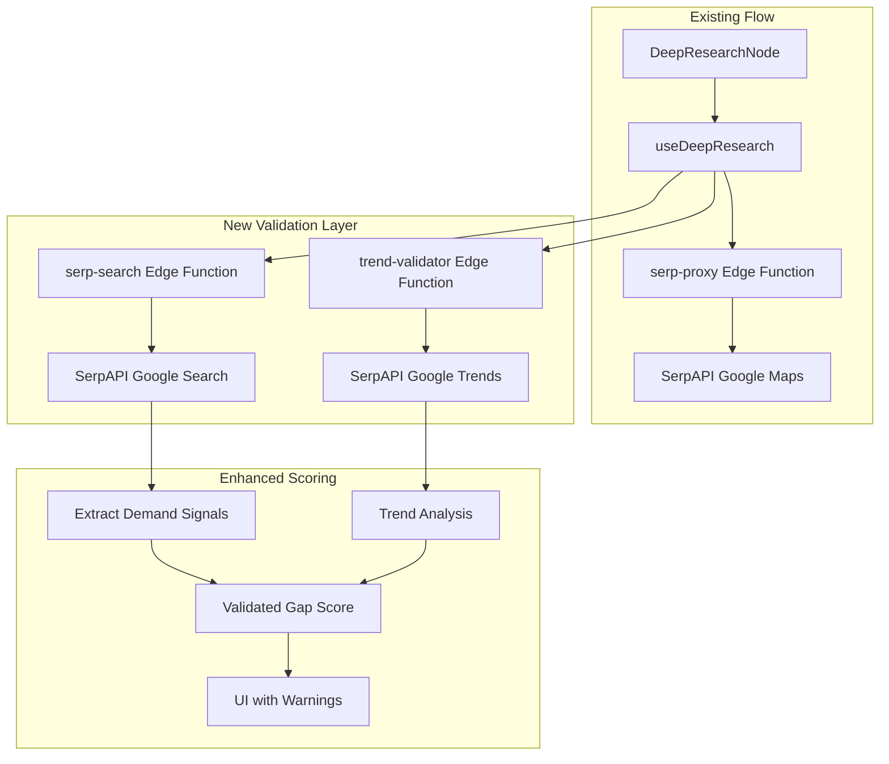

# Add Trend Validation to Deep Research Node

## Problem Summary

The current system relies on aggregated keyword data without validating trend stability. The Arlington VA garage door case showed how a single anomalous spike can inflate averages, leading to false positives. This plan adds multi-layer validation using Google Trends data and enhanced SERP signals.

## Architecture Overview



## Implementation Details

### Phase 1: Create `serp-search` Edge Function

Create a new edge function to fetch full Google Search results (not just Maps) to extract related_searches, people_also_ask, and organic results.

**File:** [`supabase/functions/serp-search/index.ts`](supabase/functions/serp-search/index.ts) (new)

Key features:

- Uses SerpAPI's `google` engine (not `google_maps`)
- Extracts: organic_results, local_service_ads, ads, related_searches, related_questions
- Returns structured `SerpDemandSignals` matching the spec

```typescript
interface SerpSearchResponse {
	organicResults: Array<{ position: number; domain: string; title: string }>;
	localServiceAds: Array<{ title: string; rating: number; reviews: number }>;
	ads: Array<{ position: number; title: string }>;
	relatedSearches: string[];
	peopleAlsoAsk: string[];
	localPack: Array<{ title: string; rating: number; reviews: number }>;
	totalResults: number;
}
```

### Phase 2: Create `trend-validator` Edge Function

Create edge function to validate demand stability using SerpAPI's Google Trends endpoint.

**File:** [`supabase/functions/trend-validator/index.ts`](supabase/functions/trend-validator/index.ts) (new)

Key features:

- Uses SerpAPI's `google_trends` engine with `data_type: 'TIMESERIES'`
- Fetches 12 months of data
- Implements spike detection: `max / median > 3` triggers warning
- Calculates volatility via standard deviation
- Determines trend direction (growing/declining/flat/volatile)
- Caches results for 30 days in Supabase

**Core algorithm:**

```typescript
// Spike detection
const spikeRatio = median > 0 ? max / median : 0;
const spikeDetected = spikeRatio > 3;

// Volatility (coefficient of variation)
const volatility = avg > 0 ? stdDev / avg : 0;
const isStable = !spikeDetected && volatility < 0.3;

// Trend direction
const changeRatio = (secondHalfAvg - firstHalfAvg) / firstHalfAvg;
```

### Phase 3: Create Frontend API Client

Add client-side functions to call the new edge functions.

**File:** [`src/api/serp/validation.ts`](src/api/serp/validation.ts) (new)

```typescript
export interface TrendValidation {
	isStable: boolean;
	spikeDetected: boolean;
	spikeRatio: number;
	averageInterest: number;
	trendDirection: 'growing' | 'declining' | 'flat' | 'volatile';
	confidenceScore: number;
	flags: string[];
	monthlyData: { date: string; value: number }[];
}

export interface SerpDemandSignals {
	lsaPresent: boolean;
	lsaCount: number;
	paidAdsCount: number;
	localPackCount: number;
	localPackTotalReviews: number;
	establishedBusinesses: number;
	relatedSearchesCount: number;
	relatedSearches: string[];
	peopleAlsoAskCount: number;
	peopleAlsoAsk: string[];
	demandConfidence: 'high' | 'medium' | 'low' | 'unvalidated';
}

export async function fetchTrendValidation(
	keyword: string,
	geo?: string,
): Promise<TrendValidation>;
export async function fetchDemandSignals(
	query: string,
	city: string,
	state?: string,
): Promise<SerpDemandSignals>;
```

### Phase 4: Update Gap Scoring

Modify the scoring logic to incorporate validation signals.

**Files to modify:**

- [`src/api/serp/analyzer.ts`](src/api/serp/analyzer.ts) - Add validation-aware analysis
- [`src/api/serp/tiers.ts`](src/api/serp/tiers.ts) - Update `assessCategoryViability()`

**New scoring breakdown (90 points max):**

| Category | Points | Criteria |

| -------------------- | ------ | ------------------------------------------ |

| Demand Validation | 0-35 | Trend stability (25), SERP confidence (10) |

| Competition Weakness | 0-25 | Aggregator dominance, LSA opportunity |

| Monetization | 0-20 | CPC value, established providers |

| Market Quality | 0-10 | Demographics (income, homeownership) |

**Critical validation rules:**

- `spikeDetected: true` → Score capped at 40, flag `SPIKE_ANOMALY`
- `averageInterest < 10` → Penalty, flag `LOW_SEARCH_INTEREST`
- `trendDirection === 'declining'` → 30% score reduction
- Conflicting signals (spike + high SERP confidence) → flag `DATA_CONFLICT`

**New types to add:**

```typescript
interface MarketValidation {
	serpSignals: SerpDemandSignals;
	trendValidation: TrendValidation;
	keywordData: { volume: string; cpc: number; yoyChange?: number };
	demographics: {
		population: number;
		medianIncome: number;
		homeownershipRate: number;
	};
}

interface ValidatedGapScore {
	score: number;
	maxScore: number;
	grade: 'A' | 'B' | 'C' | 'D' | 'F';
	verdict:
		| 'STRONG_OPPORTUNITY'
		| 'OPPORTUNITY_WITH_CAVEATS'
		| 'VALIDATE_MANUALLY'
		| 'SKIP';
	flags: string[];
	breakdown: Record<string, number>;
}
```

### Phase 5: Update `useDeepResearch` Hook

Modify the research hook to integrate validation.

**File:** [`src/hooks/useDeepResearch.ts`](src/hooks/useDeepResearch.ts)

Changes:

- Add `fetchTrendValidation()` call for top categories (parallel with SERP)
- Store validation results in `CategoryAnalysisResult`
- Update progress tracking to include validation step
- Add `validationFlags` to results

**Flow update:**

```
For each category:
  1. fetchSerpData() [existing]
  2. fetchDemandSignals() [new - parallel]
  3. fetchTrendValidation() [new - for top candidates only]
  4. analyzeSerpWithClaude() [existing, with enhanced prompt]
  5. calculateValidatedGapScore() [new]
```

### Phase 6: Update Types

**File:** [`src/types/nodes.ts`](src/types/nodes.ts)

Extend `CategoryAnalysisResult`:

```typescript
export interface CategoryAnalysisResult {
	// ... existing fields ...

	// New validation fields
	validationFlags: string[];
	trendConfidence: number;
	demandConfidence: 'high' | 'medium' | 'low' | 'unvalidated';
	spikeDetected?: boolean;
	trendDirection?: 'growing' | 'declining' | 'flat' | 'volatile';
}

export interface DeepResearchNodeData extends BaseNodeData {
	// ... existing fields ...

	// New validation summary
	validationSummary: {
		totalFlags: number;
		criticalWarnings: string[];
		trendsValidated: number;
	} | null;
}
```

### Phase 7: Update UI Components

**Files to modify:**

- [`src/components/nodes/DeepResearchNode/ResultsTable.tsx`](src/components/nodes/DeepResearchNode/ResultsTable.tsx)
- [`src/components/nodes/DeepResearchNode/OpportunitySummary.tsx`](src/components/nodes/DeepResearchNode/OpportunitySummary.tsx)
- [`src/components/nodes/DeepResearchNode/DeepResearchNode.tsx`](src/components/nodes/DeepResearchNode/DeepResearchNode.tsx)

**UI additions:**

- Warning banner at top when `criticalWarnings.length > 0`
- Flag badges on each category row (amber for warnings, red for critical)
- Trend confidence indicator (mini sparkline or percentage)
- Expandable validation details panel
- Color-coded verdicts: SKIP (red), VALIDATE_MANUALLY (amber), OPPORTUNITY_WITH_CAVEATS (yellow), STRONG (green)

### Phase 8: Add Caching

**File:** [`src/api/serp/cache.ts`](src/api/serp/cache.ts)

Add trend validation caching:

```typescript
export async function getCachedTrendValidation(
	keyword: string,
	geo: string,
): Promise<TrendValidation | null>;
export async function setCachedTrendValidation(
	keyword: string,
	geo: string,
	data: TrendValidation,
): Promise<void>;
// Cache expiry: 30 days
```

## Test Cases

After implementation, validate with:

1. **Arlington VA Garage Door** - Should flag `SPIKE_ANOMALY`, verdict: `SKIP`
2. **Plumber Phoenix AZ** - Known good market, should validate successfully
3. **Snow Removal Boston** - Seasonal, should detect seasonality not spike
4. **Declining market** - Should flag `DECLINING_TREND`

## Files Summary

**New files (4):**

- `supabase/functions/serp-search/index.ts`
- `supabase/functions/trend-validator/index.ts`
- `src/api/serp/validation.ts`
- `src/api/serp/validatedScoring.ts`

**Modified files (7):**

- `src/api/serp/analyzer.ts`
- `src/api/serp/cache.ts`
- `src/api/serp/index.ts`
- `src/hooks/useDeepResearch.ts`
- `src/types/nodes.ts`
- `src/components/nodes/DeepResearchNode/ResultsTable.tsx`
- `src/components/nodes/DeepResearchNode/DeepResearchNode.tsx`
